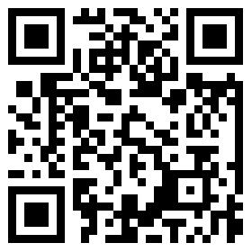
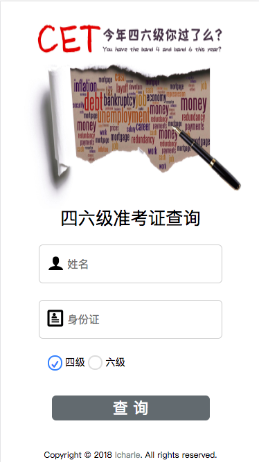
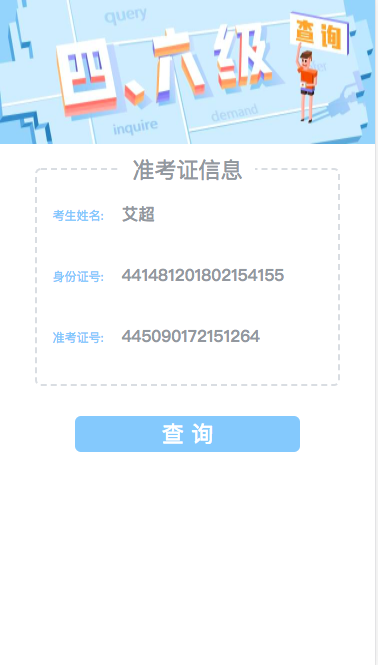
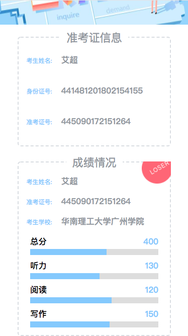
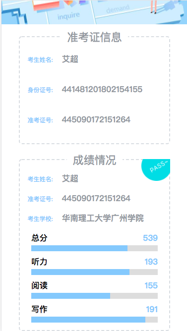

## Laravel5.5+Vue2.x简单spa项目应用:star2: :star2:

>采用laravel、vue开发的CET四六级准考证、成绩查询项目

## 项目地址

:point_right: 在线演示：https://cet.icharle.com/


## 项目效果图
* 首页  
    
* 准考证页面  
    
* 成绩显示页面( 分数 < 425 )   
    
* 成绩显示页面( 分数 >= 425)  
      
    
## 功能(v1.0版本)
- [x] 准考证查询 
- [x] 成绩查询 
- [x] 微信分享 
- [ ] 预约查询(邮件方式推送) 
- [ ] Redis消息队列方法推送 
       
## 安装使用

```
# 从仓库中下载
$ git clone https://github.com/icharle/Vue-Cet.git

# 进入代码根目录安装依赖
$ composer install
$ npm install

# copy .env文件
$ cp .env.example .env

# 生成项目key
$ php artisan key:generate

# 配置微信公众号appID && appSecret
$ appID = xxxxxx
$ appSecret = xxxxxxx

# 修改resources/assets/js/app.js文件中相关微信分享配置

# 打包压缩发布
$ npm run prod
```
